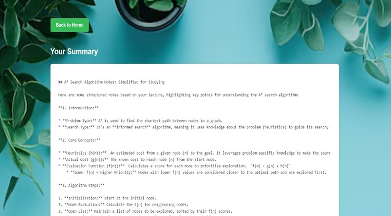
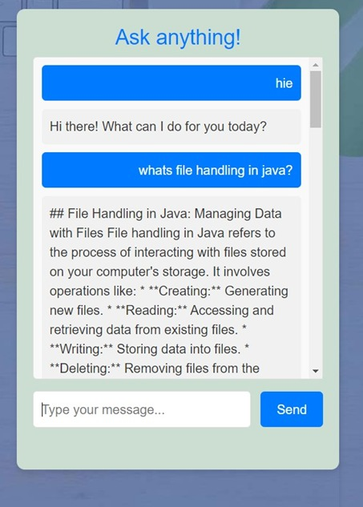
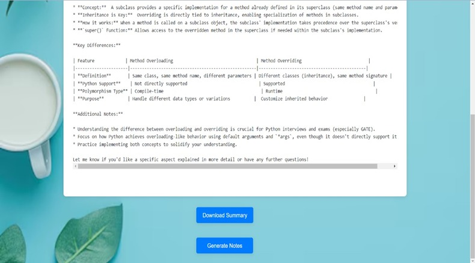
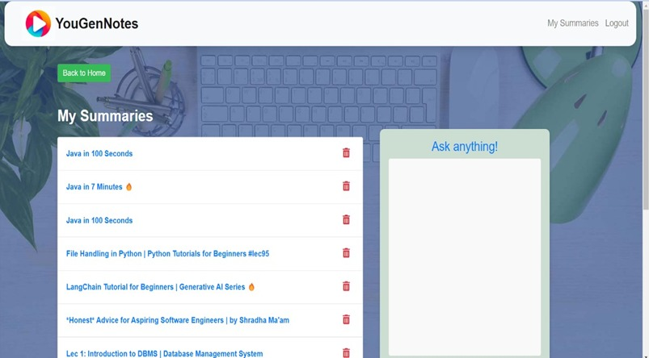

# EduTubeNotes

EduTubeNotes is an AI-powered web application that helps students and learners convert educational videos into concise summaries and structured study notes. Users can provide a YouTube lecture link or upload a video file, and the platform automatically transcribes the content, generates a summary, and creates easy-to-read notes for faster learning.

The platform includes user authentication, summary history, downloadable notes, and an integrated AI chatbot to assist users with learning-related queries — making EduTubeNotes a complete productivity tool for education.

---

## ✨ Features

- User authentication (Register/Login)
- Upload video/audio files for summarization
- Summarize YouTube lectures instantly
- AI-generated summaries and study notes
- Convert summaries into downloadable notes
- View and manage past summaries
- Integrated AI chatbot for doubts and queries

---

## 🖼 Screenshots

### Registration Page


### Login Page


### Home Page (Upload YouTube Link or Video)


### Generated Summary Page


### Generated Notes Page


### AI Chatbot


### Download Summary Option


### Saved Summaries (Local History)


---

## 🛠 Tech Stack

**Backend:** Flask (Python)  
**Frontend:** HTML, CSS, Bootstrap, JavaScript  
**Database:** MongoDB  

### AI Services
- AssemblyAI (Speech-to-Text)  
- Google Gemini (Summarization & Notes)  

### Video/Audio Processing
- FFmpeg  
- yt-dlp  

---

## Run Locally

### Clone the project
```bash
git clone https://github.com/shravan1830/EduTudeNotes.git
```

### Go to the project directory
```bash
cd EduTudeNotes
```

### (Recommended) Create a virtual environment
```bash
python -m venv env
```

### Activate the virtual environment

**Windows**
```bash
env\Scripts\activate
```

**Linux / macOS**
```bash
source env/bin/activate
```

### Install dependencies
```bash
pip install -r requirements.txt
```

---

## Configure API Keys

Open `app.py` and configure the following API keys:

```python
ASSEMBLYAI_API_KEY = "<Your AssemblyAI API Key>"
GOOGLE_API_KEY = "<Your Gemini API Key>"
```

Also ensure **FFmpeg** is installed and added to your system PATH.

---

## Start the Server
```bash
python app.py
```

The application will run at:
```text
http://127.0.0.1:5000
```

---

## 📁 Project Structure

```
EduTubeNotes/
├── app.py
├── notes.py
├── templates/
│   ├── home.html
│   ├── login.html
│   ├── upload.html
│   ├── notes.html
│   └── chatbot.html
├── static/
│   └── css/
├── uploads/
├── OUTPUT/
├── Register_Page.jpeg
├── Login_Page.jpeg
├── Home_Page.jpeg
├── Summary_Page.jpeg
├── Notes_Page.jpeg
├── Chatbot.jpeg
├── Download_Summary.jpeg
├── Saved_Summaries.jpeg
└── README.md
```

---

## Contributing

Pull requests are welcome.  
Please ensure your changes:

- Do not include API keys or credentials  
- Follow clean coding practices  
- Are well-tested before submission  

---

## 📄 License

MIT License
